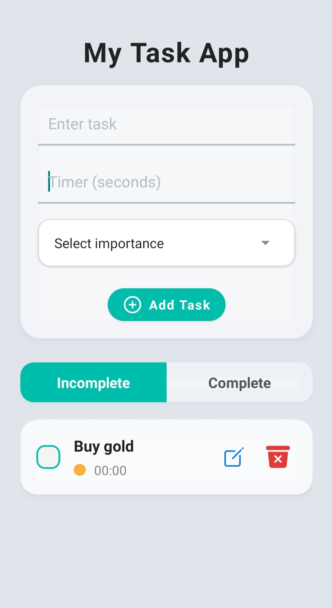
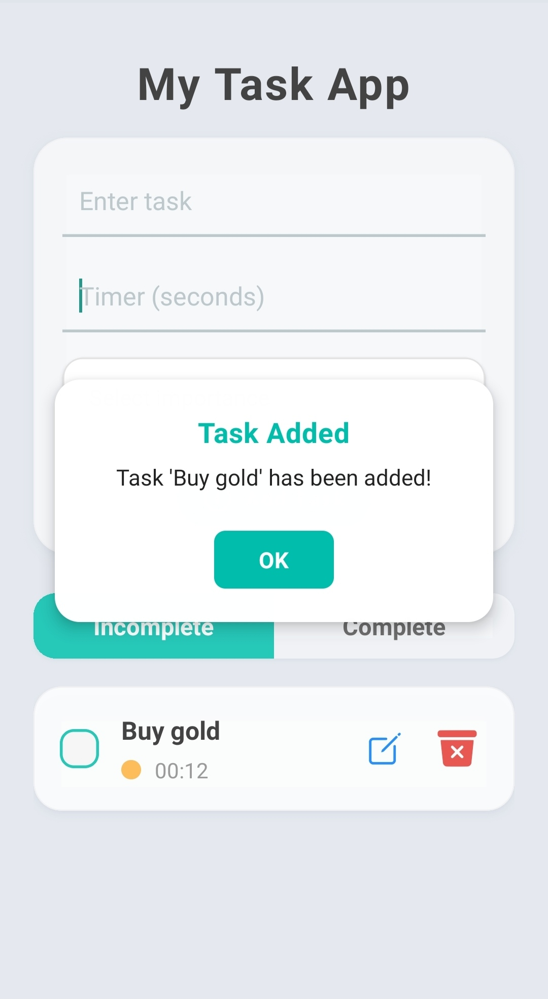
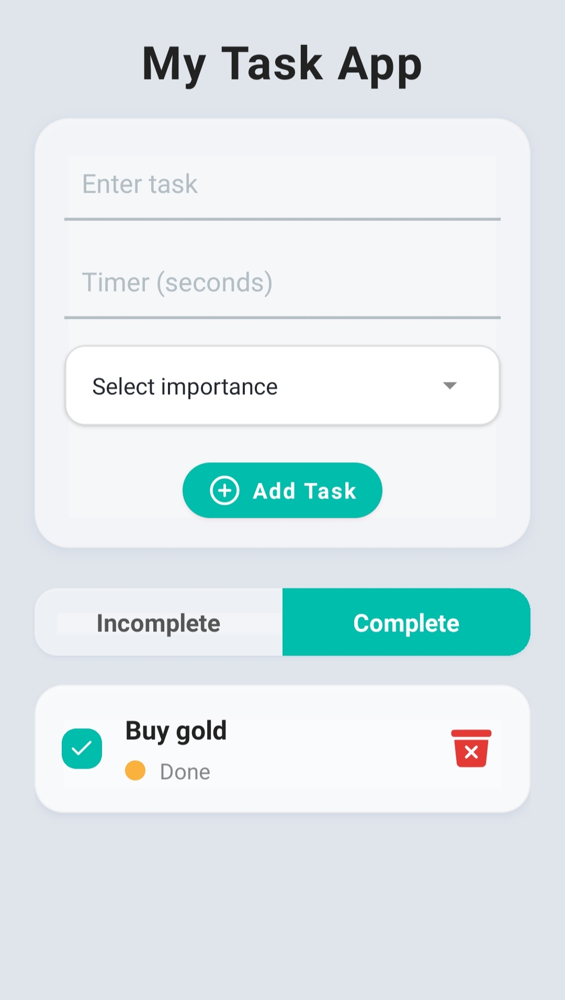

# 📱 My Task App / Mustak Ansary

A beautifully simple yet powerful **Task‑App** built with [React Native](https://reactnative.dev/) and [Expo](https://expo.dev/).  
Manage your day with timers, scheduled reminders, and a clean UI that keeps completed and pending tasks neatly separated.

---

## 🚀 Features

- 📝 **Add, edit & delete** tasks with an intuitive interface  
- 🕒 **Timer‑based notifications** to alert you when time's up  
- 🗓️ **Scheduled notifications** for future reminders  
- ❗ **Task prioritization** – mark tasks as **Urgent**, **important**, or **less important** importance  
- 🔕 **Cancel notifications** when tasks are marked complete  
- 📂 **Two‑tab view** – ✅ **Completed** | ❌ **Incomplete**  
- 💾 **AsyncStorage** for persistent local task saving  
- 🚨 **Custom alerts** after every add / edit / delete action  
- 🧭 **Expo Router** for clean file‑based navigation  
- 🌍 Runs on **Android**, **iOS**, and **Web**

---

## 📸 Screenshots

| Home | Task Details | Completed Task |
| :--: | :----------: | :------------: |
|  |  |  |


---

## 🛠️ Tech Stack

| Layer | Tech |
|-------|------|
| Framework | **React Native 0.79** |
| Runtime | **Expo ~53** |
| Storage | **@react‑native‑async‑storage/async‑storage 2.1** |
| Navigation | **Expo Router** & **@react‑navigation/bottom‑tabs** |
| Notifications | **expo‑notifications ~0.31** |
| UI / UX | **@expo/vector‑icons**, **react‑native‑reanimated**, **expo‑haptics** |
| Language | **JavaScript** (with TypeScript tooling configured) |

---

## 📦 Installation

> **Prerequisites:** Node ≥ 18, npm ≥ 9 (or Yarn / pnpm).

```bash
# 1. Install Expo CLI globally
npm install -g expo-cli

# 2. Clone the repository
git clone https://github.com/mussu777/My-Task-Assignment.git
cd My-Task-Assignment

# 3. Install dependencies
npm install         # or: yarn

# 4. Do a build locally 
npx expo prebuild
npx expo run:android or npx expo run:ios

# 5. Or do EAS build
eas login 
eas build:configure
eas build --profile preview --platform android or ios
```
---


## 🤔 Challenges Faced

One of the key challenges I encountered was handling **scheduled notifications** using `expo-notifications`. While the notifications work reliably when the app is in the **foreground**, their behavior in the **background** or when the app is **killed** was inconsistent.

I tried several configurations and workarounds to make them work smoothly, but due to platform-level restrictions (especially on Android), scheduled notifications would **sometimes not trigger** when the app was closed. This remains a known limitation and may require using native modules or alternate strategies in future versions.
